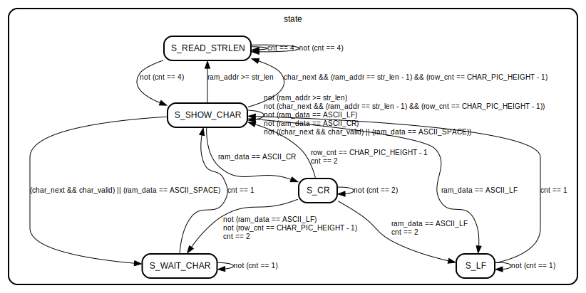

# Entity: char_buf_reader 
- **File**: char_buf_reader.v

## Diagram

## Generics

| Generic name           | Type | Value | Description |
| ---------------------- | ---- | ----- | ----------- |
| STRLENDATA_SAVED_ADDR  |      | 1023  |             |
| CHAR_BUFFER_ADDR_WIDTH |      | 12    |             |
| CHAR_PIC_HEIGHT        |      | 18    |             |
| SCREEN_WIDTH           |      | 1920  |             |
| SCREEN_HEIGHT          |      | 1080  |             |

## Ports

| Port name       | Direction | Type                         | Description |
| --------------- | --------- | ---------------------------- | ----------- |
| clk             | input     |                              |             |
| resetn          | input     |                              |             |
| cfg_start_posX  | input     | [10:0]                       |             |
| cfg_start_posY  | input     | [10:0]                       |             |
| cfg_end_posX    | input     | [10:0]                       |             |
| cfg_end_posY    | input     | [10:0]                       |             |
| cfg_char_width  | input     | [10:0]                       |             |
| cfg_char_height | input     | [10:0]                       |             |
| ram_addr        | output    | [CHAR_BUFFER_ADDR_WIDTH-1:0] |             |
| ram_data        | input     | [                       7:0] |             |
| char_ascii      | output    | [7:0]                        |             |
| char_row_index  | output    | [5:0]                        |             |
| char_pos_x      | output    | [10:0]                       |             |
| char_pos_y      | output    | [10:0]                       |             |
| char_valid      | output    |                              |             |
| char_next       | input     |                              |             |

## Signals

| Name           | Type                             | Description |
| -------------- | -------------------------------- | ----------- |
| start_posX     | reg [                      10:0] |             |
| start_posY     | reg [                      10:0] |             |
| end_posX       | reg [                      10:0] |             |
| end_posY       | reg [                      10:0] |             |
| char_width     | reg [                      10:0] |             |
| char_height    | reg [                      10:0] |             |
| str_len        | reg [                      15:0] |             |
| start_char_ptr | reg [CHAR_BUFFER_ADDR_WIDTH-1:0] |             |
| row_cnt        | reg [                       5:0] |             |
| char           | reg [                       7:0] |             |
| state          | reg [                       3:0] |             |
| cnt            | reg [                       5:0] |             |

## Constants

| Name          | Type | Value | Description |
| ------------- | ---- | ----- | ----------- |
| ASCII_LF      |      | 8'h0A |             |
| ASCII_CR      |      | 8'h0D |             |
| ASCII_SPACE   |      | 8'h20 |             |
| S_READ_STRLEN |      | 1     |             |
| S_SHOW_CHAR   |      | 2     |             |
| S_CR          |      | 3     |             |
| S_LF          |      | 4     |             |
| S_OVER        |      | 5     |             |
| S_WAIT_CHAR   |      | 6     |             |

## Processes
- unnamed: ( @(posedge clk) )
  - **Type:** always
- unnamed: ( @(posedge clk) )
  - **Type:** always
- unnamed: ( @(posedge clk) )
  - **Type:** always
- unnamed: ( @(posedge clk) )
  - **Type:** always
- unnamed: ( @(posedge clk) )
  - **Type:** always
- unnamed: ( @(posedge clk) )
  - **Type:** always
- unnamed: ( @(posedge clk) )
  - **Type:** always
- unnamed: ( @(posedge clk) )
  - **Type:** always
  - **Description**
  char_valid 数据有效 信号
 
- unnamed: ( @(posedge clk) )
  - **Type:** always
- unnamed: ( @(posedge clk) )
  - **Type:** always

## State machines

