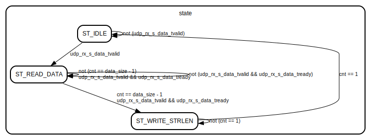

# Entity: char_buf_writer 
- **File**: char_buf_writer.v

## Diagram

## Generics

| Generic name           | Type | Value | Description |
| ---------------------- | ---- | ----- | ----------- |
| STRLENDATA_SAVED_ADDR  |      | 100   |             |
| CHAR_BUFFER_ADDR_WIDTH |      | 12    |             |

## Ports

| Port name            | Direction | Type                         | Description |
| -------------------- | --------- | ---------------------------- | ----------- |
| clk                  | input     |                              |             |
| resetn               | input     |                              |             |
| udp_rx_s_data_tdata  | input     | [ 7:0]                       |             |
| udp_rx_s_data_tlast  | input     |                              |             |
| udp_rx_s_data_tvalid | input     |                              |             |
| udp_rx_s_data_tready | output    |                              |             |
| udp_rx_s_data_tsize  | input     | [15:0]                       |             |
| ram_addr             | output    | [CHAR_BUFFER_ADDR_WIDTH-1:0] |             |
| ram_din              | output    | [                       7:0] |             |
| ram_wen              | output    |                              |             |

## Signals

| Name      | Type       | Description |
| --------- | ---------- | ----------- |
| state     | reg [ 3:0] |             |
| data_size | reg [15:0] |             |
| cnt       | reg [15:0] |             |

## Constants

| Name            | Type | Value | Description |
| --------------- | ---- | ----- | ----------- |
| ST_IDLE         |      | 0     |             |
| ST_READ_DATA    |      | 1     |             |
| ST_WRITE_STRLEN |      | 2     |             |

## Processes
- unnamed: ( @(posedge clk) )
  - **Type:** always
- unnamed: ( @(posedge clk) )
  - **Type:** always
- unnamed: ( @(posedge clk) )
  - **Type:** always

## State machines

