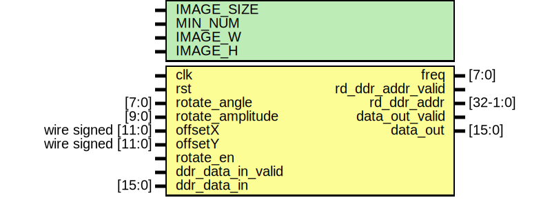
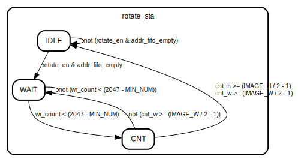
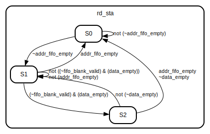

# Entity: rotate_image 
- **File**: rotate_image.v

## Diagram

## Generics

| Generic name | Type | Value | Description |
| ------------ | ---- | ----- | ----------- |
| IMAGE_SIZE   |      | 11    |             |
| MIN_NUM      |      | 1280  |             |
| IMAGE_W      |      | 1280  |             |
| IMAGE_H      |      | 720   |             |

## Ports

| Port name         | Direction | Type               | Description |
| ----------------- | --------- | ------------------ | ----------- |
| clk               | input     |                    | 时钟          |
| rst               | input     |                    | 复位          |
| rotate_angle      | input     | [7:0]              | 旋转角度        |
| rotate_amplitude  | input     | [9:0]              | 幅值          |
| offsetX           | input     | wire signed [11:0] | 位移X         |
| offsetY           | input     | wire signed [11:0] | 位移Y         |
| rotate_en         | input     |                    | 使能          |
| freq              | output    | [7:0]              |             |
| ddr_data_in_valid | input     |                    | 读取数据-有效     |
| ddr_data_in       | input     | [15:0]             | 读取数据-数据     |
| rd_ddr_addr_valid | output    |                    | 读取地址-有效     |
| rd_ddr_addr       | output    | [32-1:0]           | 读取地址-数据     |
| data_out_valid    | output    |                    | 输出数据-有效     |
| data_out          | output    | [15:0]             | 输出数据-数据     |

## Signals

| Name                       | Type                           | Description |
| -------------------------- | ------------------------------ | ----------- |
| rotate_sta                 | reg  [ 2:0]                    |             |
| rd_addr                    | reg  [ 7:0]                    |             |
| douta                      | wire [17:0]                    |             |
| cos_data                   | wire [8:0]                     |             |
| sin_data                   | wire [8:0]                     |             |
| cos_data_multed            | wire [19:0]                    |             |
| sin_data_multed            | wire [19:0]                    |             |
| cos_data0                  | wire [12:0]                    |             |
| sin_data0                  | wire [12:0]                    |             |
| image_w_add_addr           | reg signed [IMAGE_SIZE+14-1:0] |             |
| image_h_add_addr           | reg signed [IMAGE_SIZE+14-1:0] |             |
| signed_zoom                | wire [10:0]                    |             |
| offsetX_ff                 | reg signed [11:0]              |             |
| offsetY_ff                 | reg signed [11:0]              |             |
| centerX                    | reg signed [11:0]              |             |
| centerY                    | reg signed [11:0]              |             |
| cnt_w                      | reg signed [IMAGE_SIZE-1:0]    |             |
| cnt_h                      | reg signed [IMAGE_SIZE-1:0]    |             |
| wr_count                   | wire [11:0]                    |             |
| addr_fifo_empty            | wire                           |             |
| mult_p0[3:0]               | wire [IMAGE_SIZE+13-1:0]       |             |
| w_mult_add                 | reg signed [IMAGE_SIZE+14-1:0] |             |
| h_mult_add                 | reg signed [IMAGE_SIZE+14-1:0] |             |
| image_w_valid0             | reg [5:0]                      |             |
| image_w_valid              | wire                           |             |
| image_w_add0               | reg [IMAGE_SIZE+15-1:0]        |             |
| image_h_add0               | reg [IMAGE_SIZE+15-1:0]        |             |
| image_w_blank_valid        | reg                            |             |
| image_h_blank_valid        | reg                            |             |
| image_blank_valid          | reg                            |             |
| rd_ddr_addr_valid1         | reg                            |             |
| rd_ddr_add                 | wire                           |             |
| image_w_add1               | reg [IMAGE_SIZE+4-1:0]         |             |
| image_w_add2               | reg [IMAGE_SIZE+4-1:0]         |             |
| image_h_add1               | reg [IMAGE_SIZE+4-1:0]         |             |
| image_h_add2               | reg [IMAGE_SIZE+4-1:0]         |             |
| din                        | wire [3:0]                     |             |
| dout                       | wire [3:0]                     |             |
| wr_en                      | wire                           |             |
| empty                      | wire                           |             |
| full                       | wire                           |             |
| addr_fifo_rd_en            | wire                           |             |
| addr_fifo_valid            | reg                            |             |
| ddr_data_in_valid0         | reg                            |             |
| ddr_data_in0               | reg [15:0]                     |             |
| image_data                 | wire [15:0]                    |             |
| data_empty                 | wire                           |             |
| data_rd_en                 | wire                           |             |
| fifo_data_valid            | reg                            |             |
| rd_sta                     | reg [2:0]                      |             |
| rd_sta_s2                  | reg                            |             |
| fifo_blank_valid = dout[0] | wire                           |             |
| data_out2                  | reg [15:0]                     |             |
| data_out_valid0            | wire                           |             |
| data_out_valid1            | reg                            |             |
| data_out_valid2            | reg                            |             |
| data_blank_out_valid       | reg                            |             |
| cnt_num                    | reg [15:0]                     |             |
| frame_cnt                  | reg [ 7:0]                     |             |
| cnt_1s                     | reg [31:0]                     |             |

## Constants

| Name | Type | Value  | Description |
| ---- | ---- | ------ | ----------- |
| IDLE |      | 3'b001 |             |
| WAIT |      | 3'b010 |             |
| CNT  |      | 3'b100 |             |
| S0   |      | 3'b001 |             |
| S1   |      | 3'b010 |             |
| S2   |      | 3'b100 |             |

## Processes
- unnamed: ( @(posedge clk) )
  - **Type:** always
- unnamed: ( @(posedge clk) )
  - **Type:** always
- unnamed: ( @(posedge clk) )
  - **Type:** always
- unnamed: ( @(posedge clk) )
  - **Type:** always
- unnamed: ( @(posedge clk) )
  - **Type:** always
- unnamed: ( @(posedge clk) )
  - **Type:** always
- unnamed: ( @(posedge clk) )
  - **Type:** always
- unnamed: ( @(posedge clk) )
  - **Type:** always
- unnamed: ( @(posedge clk) )
  - **Type:** always
- unnamed: ( @(posedge clk) )
  - **Type:** always
- unnamed: ( @(posedge clk) )
  - **Type:** always
- unnamed: ( @(posedge clk) )
  - **Type:** always
- unnamed: ( @(posedge clk) )
  - **Type:** always
- unnamed: ( @(posedge clk) )
  - **Type:** always
- unnamed: ( @(posedge clk) )
  - **Type:** always
- unnamed: ( @(posedge clk) )
  - **Type:** always
- unnamed: ( @(posedge clk) )
  - **Type:** always
- unnamed: ( @(posedge clk) )
  - **Type:** always
- unnamed: ( @(posedge clk) )
  - **Type:** always

## Instantiations

- u_rotate_rom: rotate_rom
- u_rotate_mult_zoom0: rotate_mult0
- u_rotate_mult_zoom1: rotate_mult0
- u_rotate_mult0: rotate_mult0
- u_rotate_mult1: rotate_mult0
- u_rotate_mult2: rotate_mult0
- u_rotate_mult3: rotate_mult0
- u_store_addr: store_addr
- u_store_image_data: store_image_data

## State machines

