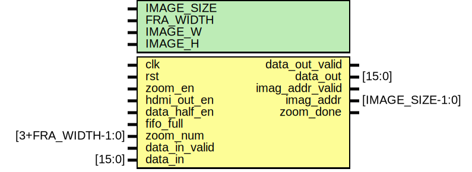
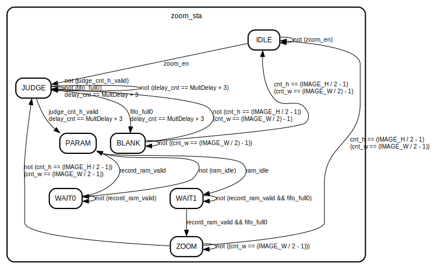
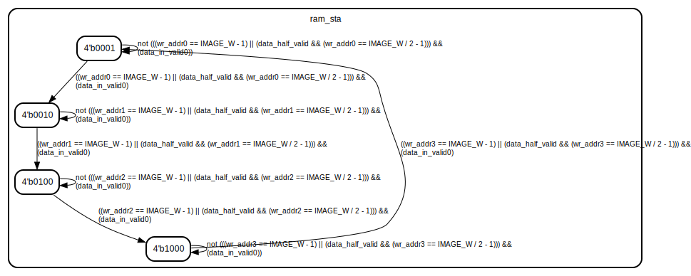

# Entity: zoom_image_v1 
- **File**: zoom_image_v1.v

## Diagram

## Generics

| Generic name | Type | Value | Description |
| ------------ | ---- | ----- | ----------- |
| IMAGE_SIZE   |      | 11    |             |
| FRA_WIDTH    |      | 7     |             |
| IMAGE_W      |      | 1920  |             |
| IMAGE_H      |      | 1080  |             |

## Ports

| Port name       | Direction | Type              | Description |
| --------------- | --------- | ----------------- | ----------- |
| clk             | input     |                   | 时钟          |
| rst             | input     |                   | 复位          |
| zoom_en         | input     |                   | 缩放使能        |
| hdmi_out_en     | input     |                   | HDMI输出使能    |
| data_half_en    | input     |                   | 数据减半使能      |
| fifo_full       | input     |                   | 输出端FIFO 满信号 |
| zoom_num        | input     | [3+FRA_WIDTH-1:0] | 缩放系数        |
| data_in_valid   | input     |                   | 数据输入-有效     |
| data_in         | input     | [15:0]            | 数据输入-数据     |
| data_out_valid  | output    |                   | 数据输出-有效     |
| data_out        | output    | [15:0]            | 数据输出-数据     |
| imag_addr_valid | output    |                   | 数据读取地址-有效   |
| imag_addr       | output    | [IMAGE_SIZE-1:0]  | 数据读取地址-地址   |
| zoom_done       | output    |                   | 一帧画面缩放完成    |

## Signals

| Name                        | Type                                    | Description |
| --------------------------- | --------------------------------------- | ----------- |
| zoom_sta                    | reg [6:0]                               |             |
| cnt_w                       | reg signed [IMAGE_SIZE-1:0]             |             |
| cnt_h                       | reg signed [IMAGE_SIZE-1:0]             |             |
| mult_cnt_h                  | reg signed [IMAGE_SIZE-1:0]             |             |
| judge_cnt_h                 | reg signed [IMAGE_SIZE+3-1:0]           |             |
| judge_cnt_h_valid           | reg                                     |             |
| ram_idle                    | reg                                     |             |
| no_need_rd_ddr              | reg                                     |             |
| no_one_need_rd_ddr          | reg                                     |             |
| record_ram[0:3]             | reg                                     |             |
| delay_cnt                   | reg [2:0]                               |             |
| param_delay                 | reg [3:0]                               |             |
| cnt_record_ram              | reg [2:0]                               |             |
| record_ram_valid            | reg                                     |             |
| data_in0                    | reg [15:0]                              |             |
| data_in1                    | reg [15:0]                              |             |
| data_in2                    | reg [15:0]                              |             |
| data_in3                    | reg [15:0]                              |             |
| coe_valid                   | reg [6:0]                               |             |
| data_in_valid0              | reg                                     |             |
| data_in_valid1              | reg                                     |             |
| data_in_valid2              | reg                                     |             |
| data_in_valid3              | reg                                     |             |
| rd_one_ram                  | reg                                     |             |
| fifo_full0                  | reg                                     |             |
| mult_w                      | wire [IMAGE_SIZE+FRA_WIDTH+3-1:0]       |             |
| mult_h                      | wire [IMAGE_SIZE+FRA_WIDTH+3-1:0]       |             |
| store_mult_h                | reg signed [IMAGE_SIZE+3-1:0]           |             |
| store_mult_h0               | reg signed [IMAGE_SIZE+3-1:0]           |             |
| ram_idle0                   | reg                                     |             |
| ram_idle1                   | reg                                     |             |
| zoom_sta_param              | reg                                     |             |
| ram_ch                      | reg [1:0]                               |             |
| zoom_num0                   | reg [3+FRA_WIDTH-1:0]                   |             |
| wr_ram_done                 | reg                                     |             |
| wr_addr0                    | reg [IMAGE_SIZE - 1:0]                  |             |
| wr_addr1                    | reg [IMAGE_SIZE - 1:0]                  |             |
| wr_addr2                    | reg [IMAGE_SIZE - 1:0]                  |             |
| wr_addr3                    | reg [IMAGE_SIZE - 1:0]                  |             |
| rd_addr                     | reg [IMAGE_SIZE - 1:0]                  |             |
| rd_addr0                    | reg [IMAGE_SIZE - 1:0]                  |             |
| rd_addr1                    | reg [IMAGE_SIZE - 1:0]                  |             |
| rd_addr2                    | reg [IMAGE_SIZE - 1:0]                  |             |
| rd_addr3                    | reg [IMAGE_SIZE - 1:0]                  |             |
| doutb0                      | wire [15:0]                             |             |
| doutb0_0                    | wire [15:0]                             |             |
| doutb1                      | wire [15:0]                             |             |
| doutb1_0                    | wire [15:0]                             |             |
| doutb2                      | wire [15:0]                             |             |
| doutb2_0                    | wire [15:0]                             |             |
| doutb3                      | wire [15:0]                             |             |
| doutb3_0                    | wire [15:0]                             |             |
| ram_sta                     | reg [3:0]                               |             |
| data_half_valid             | reg                                     |             |
| data_half_valid0            | reg                                     |             |
| data_half_valid1            | reg                                     |             |
| imag_addr_valid0            | reg                                     |             |
| imag_addr_valid1            | reg                                     |             |
| imag_addr0                  | reg signed [IMAGE_SIZE+FRA_WIDTH-1:0]   |             |
| mult_h1                     | wire [IMAGE_SIZE-1:0]                   |             |
| mult_h2                     | wire [IMAGE_SIZE+3-1:0]                 |             |
| store_addr_add_one          | wire [IMAGE_SIZE+3-1:0]                 |             |
| store_addr                  | reg signed [IMAGE_SIZE+3-1:0]           |             |
| mult_h0                     | reg signed [IMAGE_SIZE+3-1:0]           |             |
| zoom_sta_param0             | reg                                     |             |
| zoom_sta_param1             | reg                                     |             |
| addr_sta                    | reg [4:0]                               |             |
| data_half_en0               | reg                                     |             |
| imag_addr1                  | reg signed  [IMAGE_SIZE-1:0]            |             |
| add_imag_addr = IMAGE_H / 2 | wire [IMAGE_SIZE-1:0]                   |             |
| image_w0                    | reg signed [IMAGE_SIZE+FRA_WIDTH+3-1:0] |             |
| image_w1                    | reg signed [IMAGE_SIZE+FRA_WIDTH+3-1:0] |             |
| image_w2                    | reg signed [IMAGE_SIZE+FRA_WIDTH+3-1:0] |             |
| image_h0                    | reg signed [IMAGE_SIZE+FRA_WIDTH+3-1:0] |             |
| image_h1                    | reg signed [IMAGE_SIZE+FRA_WIDTH+3-1:0] |             |
| image_h2                    | reg signed [IMAGE_SIZE+FRA_WIDTH+3-1:0] |             |
| image_w2_unsigned           | wire [IMAGE_SIZE+FRA_WIDTH+3-1:0]       |             |
| image_h2_unsigned           | wire [IMAGE_SIZE+FRA_WIDTH+3-1:0]       |             |
| zoom_num1                   | reg [IMAGE_SIZE+FRA_WIDTH+3-1:0]        |             |
| add_image_w                 | wire [IMAGE_SIZE+FRA_WIDTH+3-1:0]       |             |
| add_image_h                 | wire [IMAGE_SIZE+FRA_WIDTH+3-1:0]       |             |
| ram_ch0                     | reg [1:0]                               |             |
| ram_ch1                     | reg [1:0]                               |             |
| ram_ch2                     | reg [1:0]                               |             |
| rd_data                     | reg [16*2-1:0]                          |             |
| rd_data0                    | reg [16*2-1:0]                          |             |
| rd_data_0                   | reg [16*2-1:0]                          |             |
| rd_data0_0                  | reg [16*2-1:0]                          |             |
| image_w2_coe                | reg [6:0]                               |             |
| image_w2_coe0               | reg [6:0]                               |             |
| image_w2_coe1               | reg [6:0]                               |             |
| image_w2_coe2               | reg [6:0]                               |             |
| image_w2_coe3               | reg [6:0]                               |             |
| image_h2_coe                | reg [6:0]                               |             |
| image_h2_coe0               | reg [6:0]                               |             |
| image_h2_coe1               | reg [6:0]                               |             |
| image_h2_coe2               | reg [6:0]                               |             |
| coe0                        | reg [7:0]                               |             |
| coe1                        | reg [7:0]                               |             |
| coe2                        | reg [7:0]                               |             |
| coe3                        | reg [7:0]                               |             |
| coe0_0                      | reg [7:0]                               |             |
| coe1_0                      | reg [7:0]                               |             |
| coe2_0                      | reg [7:0]                               |             |
| coe3_0                      | reg [7:0]                               |             |
| image_valid[7:0]            | reg [2:0]                               |             |
| image_w_valid               | reg [1:0]                               |             |
| image_h_valid               | reg [1:0]                               |             |
| image_blank_valid           | reg                                     |             |
| coe_mult_p0                 | wire [15:0]                             |             |
| coe_mult_p1                 | wire [15:0]                             |             |
| coe_mult_p0_0               | wire [15:0]                             |             |
| coe_mult_p1_0               | wire [15:0]                             |             |
| mult_image0  [5:0]          | wire [14:0]                             |             |
| mult_image0_0[5:0]          | wire [14:0]                             |             |
| mult_image1  [2:0]          | reg [15:0]                              |             |
| mult_image2  [2:0]          | reg [15:0]                              |             |
| mult_image1_0[2:0]          | reg [15:0]                              |             |
| data_out0                   | wire [15:0]                             |             |
| data_out1                   | reg [15:0]                              |             |
| data_out_valid1             | reg                                     |             |
| data_out2                   | reg [15:0]                              |             |
| data_out_valid2             | reg                                     |             |
| hdmi_out_en0                | reg                                     |             |
| cnt_ww                      | reg [IMAGE_SIZE-1:0]                    |             |
| cnt_hh                      | reg [IMAGE_SIZE-1:0]                    |             |
| hdmi_out_en1                | reg                                     |             |

## Constants

| Name          | Type | Value          | Description |
| ------------- | ---- | -------------- | ----------- |
| IDLE          |      | 7'b000_0001    |             |
| JUDGE         |      | 7'b000_0010    |             |
| PARAM         |      | 7'b000_0100    |             |
| WAIT0         |      | 7'b000_1000    |             |
| WAIT1         |      | 7'b001_0000    |             |
| ZOOM          |      | 7'b010_0000    |             |
| BLANK         |      | 7'b100_0000    |             |
| FraWidthPower |      | 1 << FRA_WIDTH |             |
| MultDelay     |      | 1              |             |

## Processes
- unnamed: ( @(posedge clk) )
  - **Type:** always
- unnamed: ( @(posedge clk) )
  - **Type:** always
- unnamed: ( @(posedge clk) )
  - **Type:** always
- unnamed: ( @(posedge clk) )
  - **Type:** always
- unnamed: ( @(posedge clk) )
  - **Type:** always
- unnamed: ( @(posedge clk) )
  - **Type:** always
- unnamed: ( @(posedge clk) )
  - **Type:** always
- unnamed: ( @(posedge clk) )
  - **Type:** always
- unnamed: ( @(posedge clk) )
  - **Type:** always
- unnamed: ( @(posedge clk) )
  - **Type:** always
- unnamed: ( @(posedge clk) )
  - **Type:** always
- unnamed: ( @(posedge clk) )
  - **Type:** always
- unnamed: ( @(posedge clk) )
  - **Type:** always
- unnamed: ( @(posedge clk) )
  - **Type:** always
- unnamed: ( @(posedge clk) )
  - **Type:** always
- unnamed: ( @(posedge clk) )
  - **Type:** always
- unnamed: ( @(posedge clk) )
  - **Type:** always
- unnamed: ( @(posedge clk) )
  - **Type:** always
- unnamed: ( @(posedge clk) )
  - **Type:** always
- unnamed: ( @(posedge clk) )
  - **Type:** always
- unnamed: ( @(posedge clk) )
  - **Type:** always
- unnamed: ( @(posedge clk) )
  - **Type:** always

## Instantiations

- u_image_w_mult: mult_image_w
- u_image_h_mult: mult_image_w
- zoom_ram0: zoom_ram
- zoom_ram1: zoom_ram
- zoom_ram2: zoom_ram
- zoom_ram3: zoom_ram
- zoom_ram0_0: zoom_ram
- zoom_ram1_0: zoom_ram
- zoom_ram2_0: zoom_ram
- zoom_ram3_0: zoom_ram
- mult_fra0: mult_fra0
- mult_fra1: mult_fra0
- mult_fra0_0: mult_fra0
- mult_fra1_0: mult_fra0

## State machines

